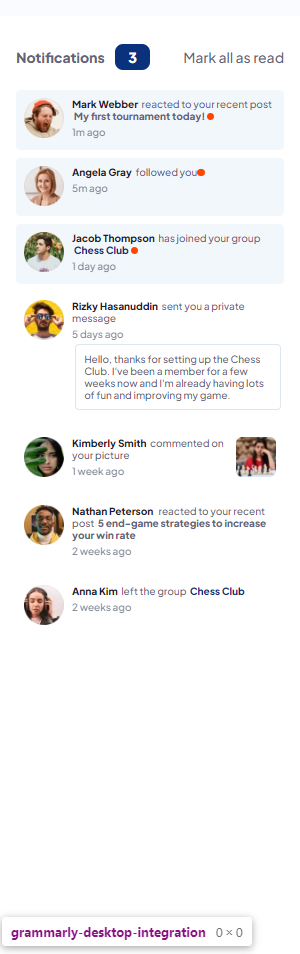
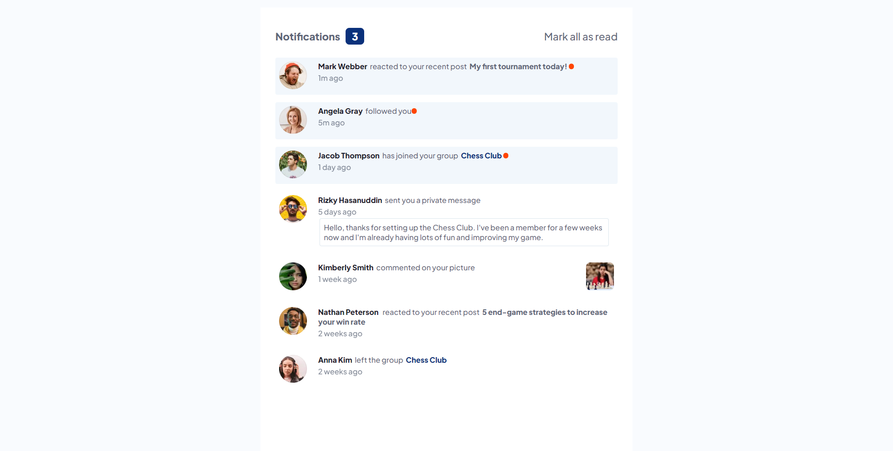

# Frontend Mentor - Notifications page solution

This is a solution to the [Notifications page challenge on Frontend Mentor](https://www.frontendmentor.io/challenges/notifications-page-DqK5QAmKbC). Frontend Mentor challenges help you improve your coding skills by building realistic projects. 

## Table of contents

- [Overview](#overview)
  - [The challenge](#the-challenge)
  - [Screenshot](#screenshot)
  - [Links](#links)
- [My process](#my-process)
  - [Built with](#built-with)
  - [What I learned](#what-i-learned)
  - [Continued development](#continued-development)
- [Author](#author)

## Overview

### The challenge

Users should be able to:

- Distinguish between "unread" and "read" notifications
- Select "Mark all as read" to toggle the visual state of the unread notifications and set the number of unread messages to zero
- View the optimal layout for the interface depending on their device's screen size
- See hover and focus states for all interactive elements on the page

### Screenshot

### Links

- Live Site URL: [https://kmarsic.github.io/notification-page-main-template/](https://kmarsic.github.io/notification-page-main-template/)

## My process

### Built with

- Semantic HTML5 markup
- CSS custom properties
- Flexbox
- Mobile-first workflow

### What I learned

On this project I familiarized myself with the forEach() function and its' quirks and solidified my flexbox skills as well.

### Continued development

I'm working towards making a chat app and I believe this project will make it easier for me to implement a notification page feature in it.

## Author

Frontend Mentor - [https://www.frontendmentor.io/profile/kmarsic](https://www.frontendmentor.io/profile/kmarsic)
LinkedIn - [https://www.linkedin.com/in/kmarsic/](https://www.linkedin.com/in/kmarsic/)
